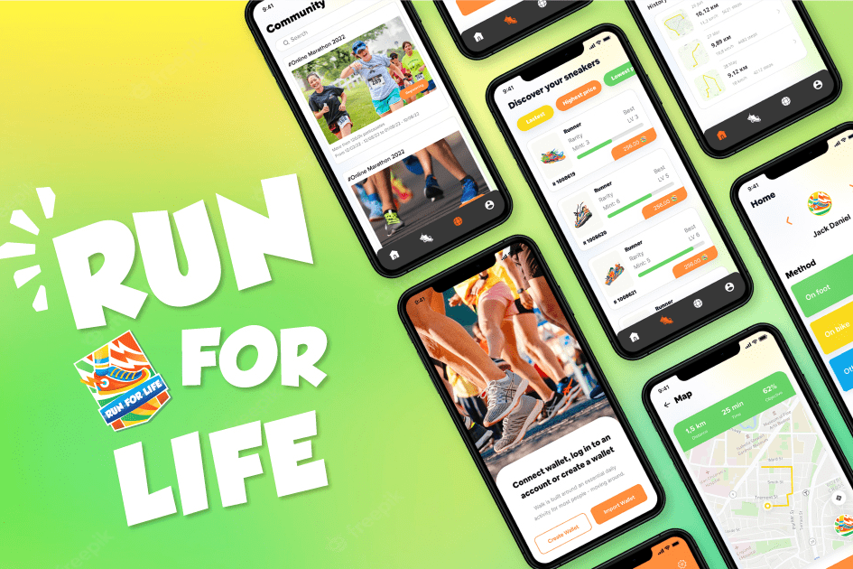

# Run For Life

Run For Life 是一个 Web3 生活方式应用程序，用于通过社交和金融元素锻炼和赚钱。 您可以在每天步行、慢跑、跑步和获得真正的健康时赚取加密货币。
Run For Life 旨在推动数百万人走向更健康的生活方式，与社会邪恶作斗争，并将公众与 Web 3.0 联系起来，同时解决其 Social-Fi 维度，以构建一个驱动用户生成的 Web 3.0 内容的长期平台。
我们很自豪不仅能将激情联系起来，还能用价值观激励社区：人类健康 - 经济价值观

RFL 是用于：
*质押：Run For Life 持有者可以质押以获得奖励
*奖励：RFL 将在参加 Run For Life 的“移动赚钱”时获得奖励
*付款方式：用于购买/出售/租用 NFT 运动鞋
*治理：Run For Life 项目的所有者可以质押 RFL 对所需功能进行投票。

