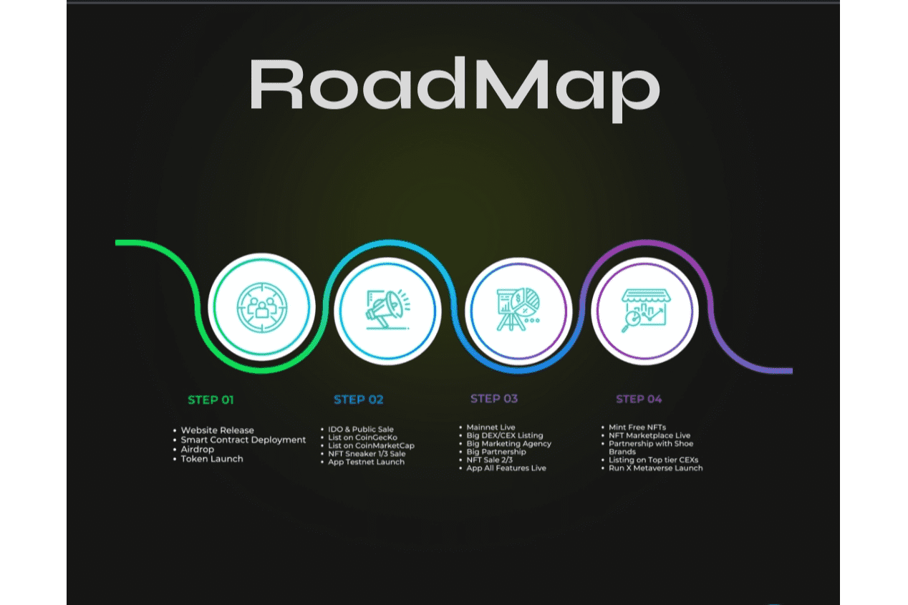

# Run X

多链网络上第一个基于真实元界角色的元界Move 2 Earn、Count 2 Earn和Ride 2 Earn应用程序
第一个基于真实元界角色的元界移动 2 赚取、计数 2 赚取和阅读 2 赚取应用程序在多链网络上。

RUNX 的构建方式及其目标：

RUNX 基于大多数人的日常活动：移动。 我们是第一个创建和实施可持续的、有效的移动到收入 (M2E) 模型的团队。
RUNX 是一个 web3 健康和生活方式的便携式应用程序，具有内置的 NFT 游戏和社交网络组件，您可以在其中通过散步、跑步和骑自行车等开发来获得 Crypto/NFT 的奖品。
首先，你铸造一个免费的 NFT，然后通过数数、跑步和骑自行车，你将获得游戏内的数字货币，这些数字货币既可以用于游戏中的练习，也可以换取利益。

