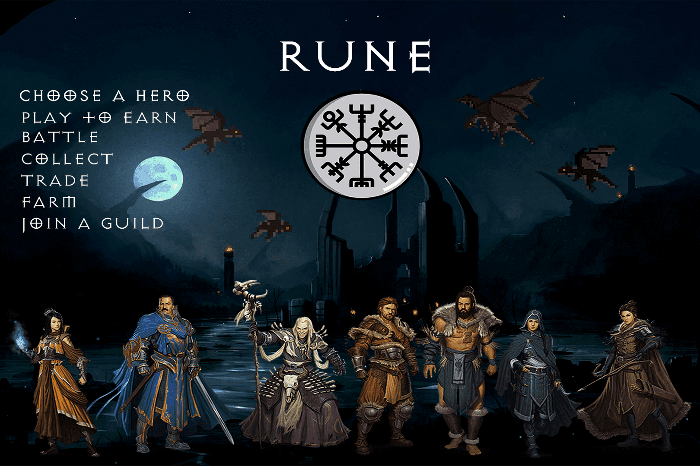

# Rune

Rune 是一款黑暗奇幻角色扮演游戏 (RPG)。 玩并获得符文。 使用符文来制作可用于使您的角色更强大的装备 (NFT)。 通过突袭农场、制作、借贷、交易独特装备以及与其他玩家、公会和 AI 争夺胜利，在这款令人上瘾的游戏中赚取加密货币。 我们将在 2022 年将这款游戏带入虚拟现实 MMORPG。

想象一个您拥有真正所有权、控制权和影响力的数字游戏世界。你已经发展了你的技能和知识，现在你的努力得到了回报。

我们的目标是让奖励感到有意义，并为至少 1% 的最有才华/最努力工作的玩家提供收入。

只会有 33 个符文，每个符文都有不同的用途。符文可用于解锁特定功能，或用于制作物品。然后玩家通过赢得游戏或在游戏中随机找到符文来奖励符文。

不断发展的 NFTS

需要符文来制作符文 (NFT)、独特而强大的武器和盔甲，用于增强符文突袭农场奖励或增强符文无限英雄。

为机制提供动力的物品属性直接内置在 NFT 本身中。这些物品可用于所有符文游戏，甚至是非我们发行的游戏。我们称这些为不断发展的 NFT。

