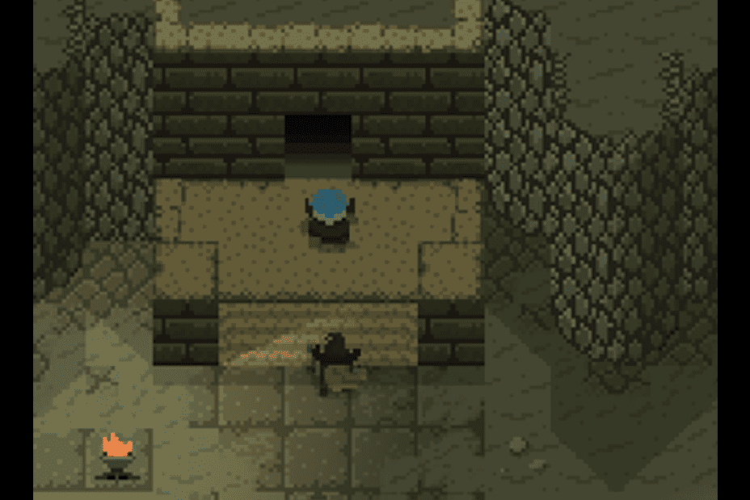

# Runeguard

Runeguard 是一种利用 NFT 和区块链技术力量的独特多方面游戏体验。玩家在与朋友一起探索类型丰富的 MMO 集换式卡牌游戏的同时进行交易、战斗、赚取 NFT 和代币。
玩家将探索 Hirelm 丰富的奇幻土地；广阔的山地景观，旅行者来这里寻找隐藏在深山深处的未知力量。这些土地上充满了许多奇幻的生物和种族，其中一些为许多人所知，而另一些则无人知晓。
让我们玩家的交易卡集合成为 NFT 使我们能够实现世界上第一个真正的数字 TCG 体验。集换式卡牌游戏的一个核心特点是能够通过交流与社区互动。交易是 Runeguard 将充分利用的数字 TCG 中非常需要但不存在的功能。我们的玩家群将能够不受限制地与其他冒险家进行买卖和交易，允许他们通过深入的社区参与来增加他们的收藏。
创建一个与 TCG 相媲美的社交和竞技类型是 Runeguard 的核心愿景，但游戏提供的远不止这些。
我们的目标是将 NFT 带入主流，成为我们的核心游戏公司，利用区块链技术的力量将我们的游戏玩法发展到下一代游戏。

