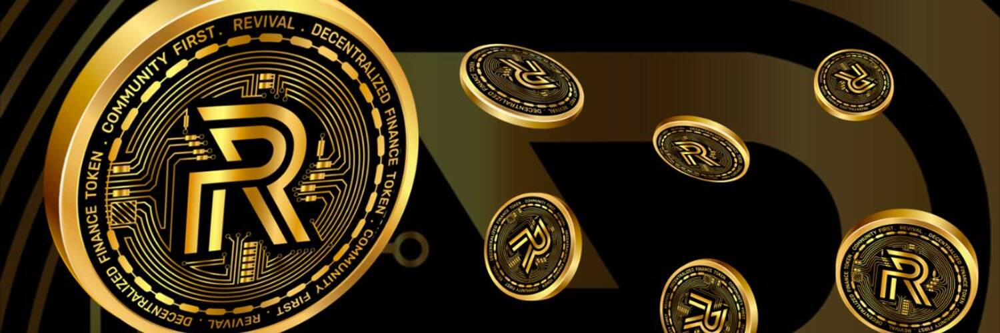

# RVL.FINANCE

VIVAL (VIV) 是 REVIVAL DeFi 生态系统的治理代币，旨在奖励持有者，同时支持扩展到更广泛的中心化加密领域。 治理代币的采用使 REVIVAL 团队能够创建一种用于中心化交易所的产品，并作为对 RVL 代币的补充，用于项目的质押平台。 这允许用户质押他们获得的 VIV 以在 RVL 中创造更多奖励，或者在市场上出售他们获得的 VIV。
VIVAL（VIV）是 REVIVAL DeFi 生态系统的治理代币，旨在奖励持有者。

