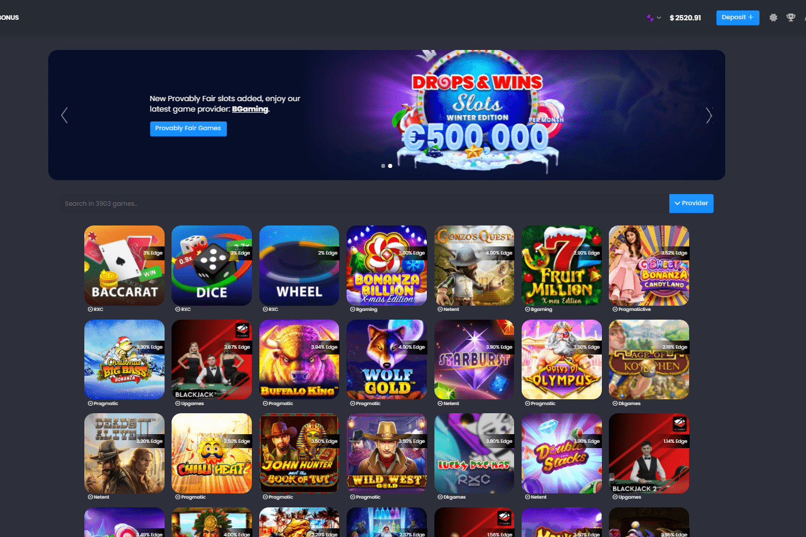

# RXCgames

RXC games 是一个游戏平台，它使用基于我们平台的原生代币 Binance Smart Chain 构建的 RXC games (RXCG) 代币。最初是在游戏之夜进行的友好赌注，后来一直是一个想法，最后变成了最新的在线赌场，包括现场游戏在内的最新游戏，游戏数量超过 5000 场。我们获得了大约 70 家顶级供应商的完全许可，包括 Playtech、Microgaming、Playson、Konami 等。我们的团队目前由 CEO、两名 CFO、CTO 和另外 3 名开发人员和一名 CM 组成。合约方面，它是由 Trynos 从头开始制作的多重签名合约。我们决定采用 3% 买入和 5% 卖出的低税率来吸引更多投资者。我们的总供应量为 100 000 000 RXCG。我们的社区成员能够从一开始就看到我们平台的预览以及我们的提供商的完整列表。考虑到我们的社区并希望他们信任我们并与我们保持安全，我们做了一些在加密世界中不寻常的事情，我们在推出我们的代币之前开发了我们的实用程序。未来还不是很远，所以我们尽可能地制定了路线图，并在运行中添加更多内容。在 2022 年第一季度，我们计划进行赌场内交换，以使我们的玩家更轻松，为我们的持有者提供质押平台，CEX 上市和更多的合作伙伴关系。为了展示我们的社区对我们的重要性，计划在 2022 年第二季度建立治理论坛和 DAO 社区。这样，当你持有 $RXCG 时，它真的意味着你是我们的一部分。至于接下来的几个季度，它将是由我们的忠实持有者由 DAO 管理。

