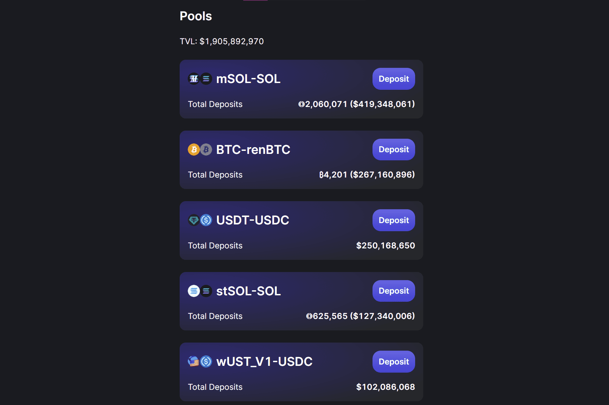

# Saber

Sabre 是第一家针对在 Solana 上交易锚定资产进行优化的自动化做市商。 我们的协议使 Solana 用户和应用程序能够有效地在稳定的资产对之间进行交易，并通过为平台提供流动性来赚取收益。

Sabre 是Solana上的一个自动化做市商和流动性池，旨在在价格相似（挂钩）的资产之间进行极其高效的交易，而无需机会成本。

这种交易活动会为流动性提供者收取费用，从而产生代表现实世界交易量的更安全、风险更低的赌注机会。

Sabre 通常允许在意味着价格恢复的资产之间进行交易。Sabre 专注于几项资产：

美元稳定币。存在数百种以美元为基础的稳定币，包括美元支持的稳定币（如USDC和Tether）、去中心化的稳定币（如UST ）和原生 Solana稳定币（如Cashio ） 。
桥接资产。有大量的桥梁通向 Solana，而 Saber 是不同桥接资产之间交换的主要流动性来源。一个例子是renBTC-BTC池，它允许在Ren和FTX版本的比特币之间进行交换。许多稳定币也是桥接资产；Sabre 是 Solana 用户在不同链之间导航的主要方式。
抵押衍生品。Sabre 是交易 SOL 权益衍生品的最大场所，例如Marinade SOL和Lido SOL。

