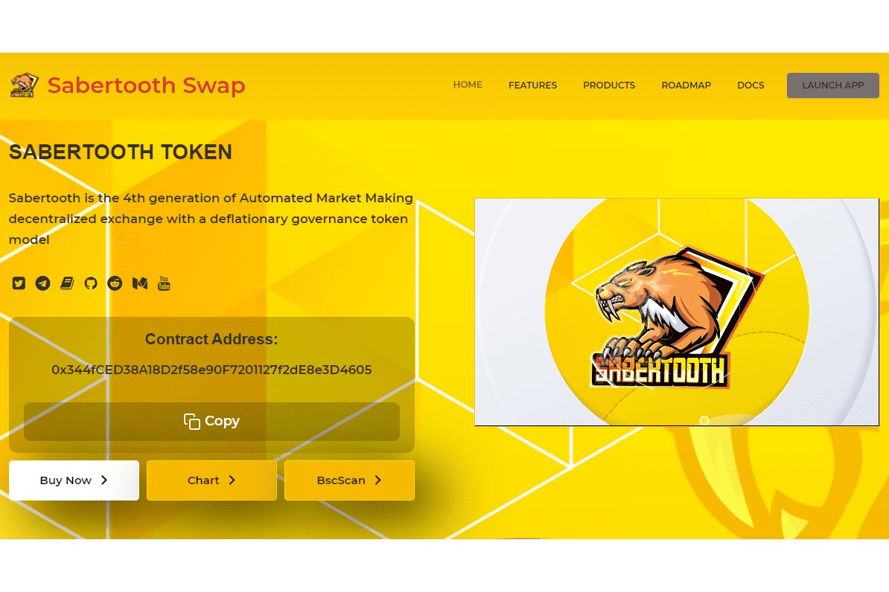

# SabertoothSwap

Sabertooth 是第四代自动做市去中心化交易所，采用通缩治理代币模型。此外，Sabertooth 是一个包含彩票和 NFT 游戏的收益农业项目。该项目旨在以奖励玩家的方式将农业体验与区块链游戏相结合。
最近我们注意到币安智能链网络频繁发生闪贷攻击。虽然团队在深入审查我们的合约代码库并咨询了多个专业安全机构时格外谨慎，但我们已执行以下措施以确保我们的合约安全。‌

  我们已经阻止合约在我们的代码中调用我们的合约，这将基本上消除闪贷攻击的可能性，因为攻击者必须使用他/她自己的合约来调用我们的合约。
  我们正在考虑使用延迟价格馈送和多价 Oracle。
  Anti-Whale 功能在一些项目中导致了一些收获方面的 bug，但我们的合约是固定的，不包含这个 bug。

Sabertooth继承了老一代良种农场的独特特征，走向稳定的商业模式：

  高产农业
  金库
  古老的
  AMM
  彩票游戏
  NFT 游戏
  自动流动性和燃烧
  收获锁定
  反鲸
  存款费用再分配
  推荐计划

