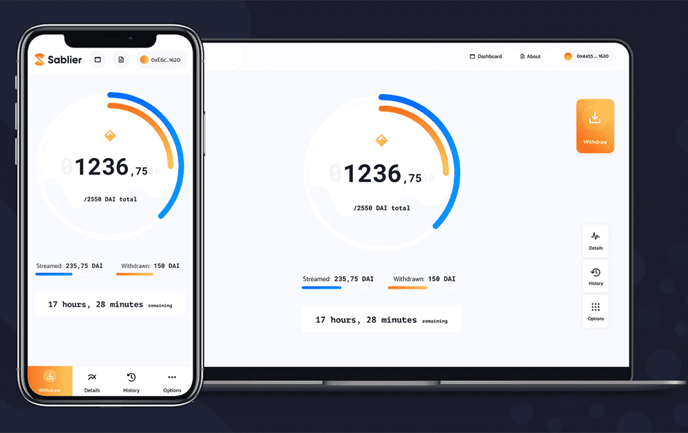

# Sablier

Sablier是什么？
Sablier 是一种代币流协议，可在 Ethereum、Optimism、Arbitrum、Polygon、Ronin、Avalanche 和 BSC 上使用。这是有史以来第一个以加密货币构建的同类产品，其起源可以追溯到 2019 年。类似于在 Netflix 上播放电影或在 Spotify 上播放歌曲的方式，因此你可以在 Sablier 上按秒播放代币。

我们创造了一个术语，用于强调 Sablier 协议的广泛用例。我们喜欢将工作视为重新思考金融合同中建立信任的方式的尝试。

想象一下，Alice 想在整个 1 月份向 Bob 支付 3,000 DAI。

1. *Alice 在 1 月 1 日之前*将 3,000 DAI 存入 Sablier ，将停止时间设置为 2 月 1 日。

2. 从 1 月 1 日开始，鲍勃的加密货币收入每秒都在增加。

3. 1 月 10 日，Bob 将获得大约 1,000 DAI。

4. 如果在一月份的任何时候 Alice 希望恢复她的令牌，她可以取消流并恢复尚未流式传输的内容。

   
