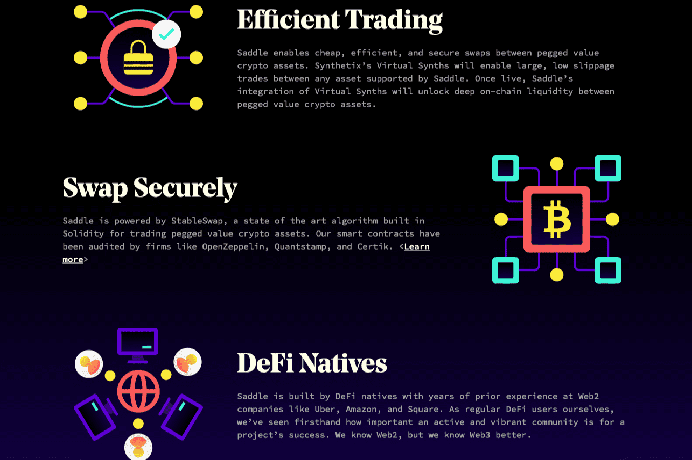

# Saddle Finance

Saddle 是使用挂钩价值加密资产进行交易和赚钱的最简单方式，从代币化比特币开始。
Saddle 是一个自动化做市商，针对挂钩价值加密资产之间的交易进行了优化。
Saddle 推出了一个代币化的比特币池，这是我们解锁深度链上流动性的第一步。
Saddle 由 StableSwap 提供支持，StableSwap 是一种内置于 Solidity 中用于交易挂钩价值加密资产的最先进算法。 我们的智能合约已经过 OpenZeppelin、Quantstamp 和 Certik 等公司的审计。
Saddle 由 DeFi 本地人构建，他们在 Uber、Amazon 和 Square 等 Web2 公司拥有多年经验。 作为 DeFi 的普通用户，我们亲眼目睹了活跃和充满活力的社区对于项目成功的重要性。 我们了解 Web2，但我们更了解 Web3。

