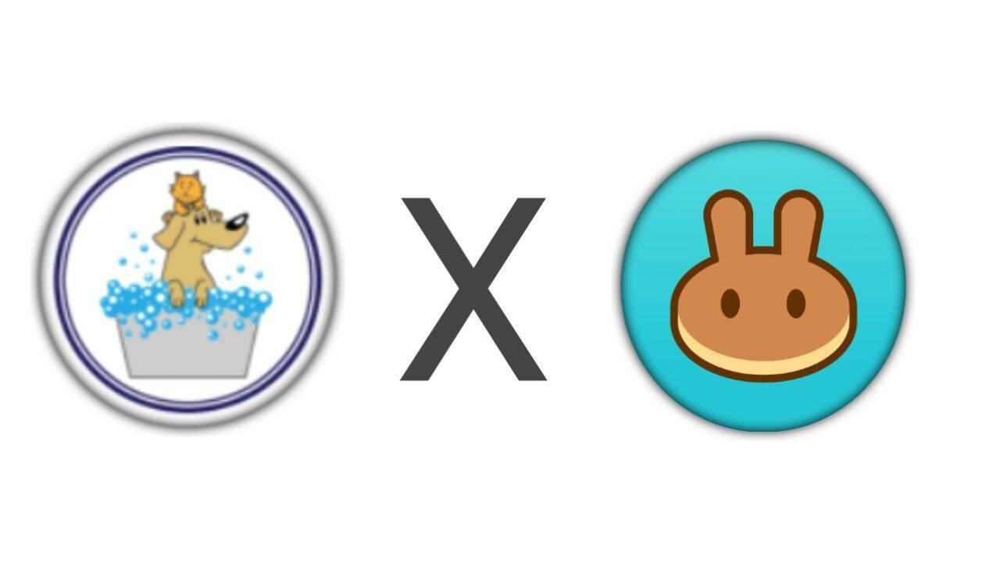

# safe cat

安全猫是建立在币安智能链网络上的去中心化Token。
SafeCat 正在建立一个社区拥有的金融基础设施，为去中心化的未来带来更多的稳定性和透明度。

安全猫是建立在币安智能链网络上的去中心化Token
$scat 是第一个由安全猫社区创建的代币，它具有许多代币经济学，以使我们的hodlers 在每笔被烧毁的交易中变得富有。我们敢于向您出售。

总安全猫供应量：1,000,000,000

Pancakeswap 流动性 50%
预售 - ICO 10%
空投/活动 10%
质押 10%
燃烧，更多 25%

🗒 代币信息：

代币名称：安全猫
代币符号：scat
十进制：18
黑链：bep20

