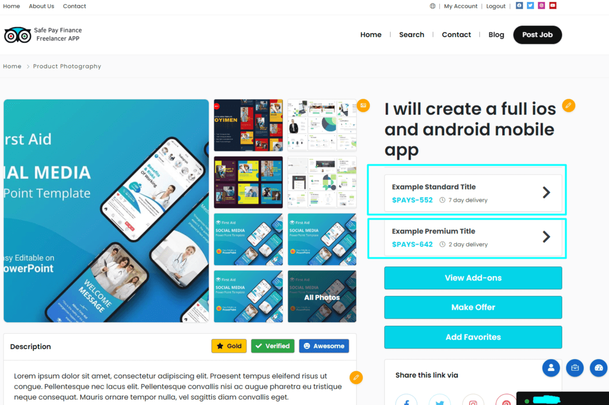

# Safe Pay Finance

加密货币世界中的所有汇款交易都是由去中心化的匿名钱包进行的，其所有者未知。
尽管可以使用对所有人开放的透明钱包来跟踪个人或公司的汇款，但不知道在什么级别进行转账以及出于什么原因进行转账，在谁之间进行转账以及原因未知！
众所周知，除了非常罕见的情况（比如一些大型的全球交易所），也就是说，除了热钱包，汇款不能退，任何网络错误都不能退。
除此之外，在商业世界中，还有很多骗子想要故意使用身份不明且不可撤销的交易。
几乎每天在加密货币资产市场，尤其是通过社交媒体账户（特别是通过电报），这些骗子都会针对你。
如果您请求任何帮助，或者您请求作为自由职业者或项目所有者的工作，您无法确定与您打交道的人是否可靠。
自由职业者在网站建设、标志设计、数字内容制作、NFT 内容制作、宣传视频准备以及公关和营销服务等所有学科和多个类别中服务的最大和最常见的问题是什么？
雇主和服务提供者之间最大的问题是相互的商业协议是不可靠的，因为在加密货币资产的世界里，双方都不知道付款的明确身份，也没有集中的审批。

