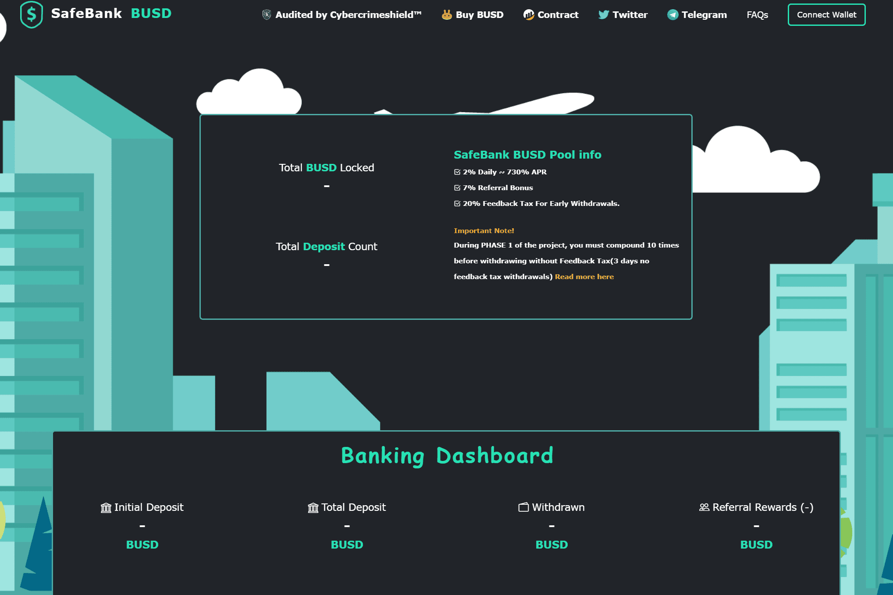

# SafeBank BUSD

SafeBank BUSD 是建立在多链上的去中心化银行，每天有 1-2% 的税收奖励。 安全、可靠、透明和快速。 支付给用户的奖励来自借贷 Dapp 税。 抵押您的加密货币以低息借入 BUSD。 这笔利息将支付给 BUSD Dapp。

将您的#SafeBtc Bsc LP 质押在我们的 dApp 上，并享受高达 700% 的稳定 Apy。

您可以随时领取您的#sBank 奖励，将您的#SafeBank 放在您的钱包中，并在#Busd 中接收#AutoYield 反射。

afeBTC 团队发布的 SafeBank 既是 Erc20 和 Bep20 创新代币，其智能合约允许运营商及其用户在特定市场条件下选择最有利可图的奖励。

质押您的 SafeBTC 并获得 BUSD/USDC 作为稳定奖励。如果在任何时候，ETH 或 BNB 突破并开始抽水，我们将通过 1 次单击将奖励切换到上升趋势的加密货币。

