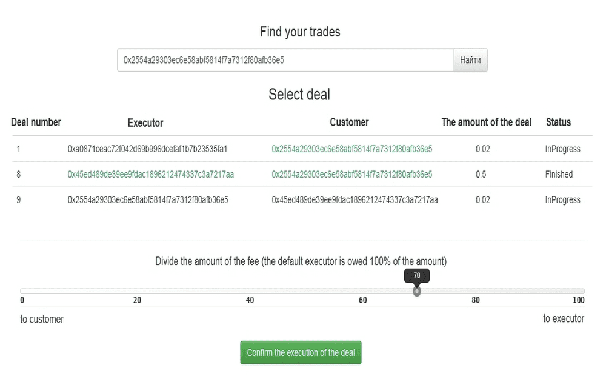

# safebas.me

什么是 SafeBAS.me？ SafeBAS - Safe Buying and Selling 这是一种方便的在线买卖双方无现金结算方式。这是一种自动、完全透明和匿名的交易方式。这些都是无限制的交易 这是监管机构的缺失。缺乏第三方组织进行交易的服务 没有人会知道交易的细节（谁将资金转移给谁以及用于什么） 所有交易都是在负责交易的智能合约的帮助下自动进行的交易的安全性和匿名性 所有交易交易都存储在区块链中 - 一个分布式数据库，其中存储设备是去中心化的，没有人控制 所有计算都在流行的匿名加密货币以太坊中进行 SafeBAS.me 安全交易服务的工作原理 您以任何方便您的方式协商交易的条件和金额，通过信使、亲自等方式。客户（买方）通过输入承包商（卖方）的地址和交易金额在服务中创建交易.资金在智能合约上被冻结。各方遵守交易条款/li>；此外，客户和承包商确认交易的执行和费用分割的百分比。交易双方确认交易后，智能合约根据双方的约定，自动将资金划转给交易双方。如果双方不同意，冻结的资金将退回原钱包。服务是匿名和免费的

