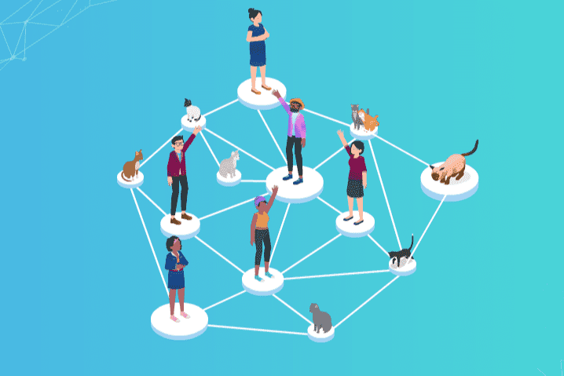

# Safecat

SAFECAT 价格实时数据
Safecat 是一个基于区块链技术的小猫收养社交网络，主要通过我们先进的移动应用程序运行，并为 Foster Homes 和 Animal Shelters 提供高度自适应的软件。我们的基本使命和运营目的是为世界各地的小猫和动物收容所提供技术和资金支持。

我们的目标：我们希望将包含在网络中的小猫添加到移动应用程序的区块链数据库中。收养者和动物收容所可以随时以快捷方便的方式管理所有小猫信息。移动应用程序将充当数据流的网关。

