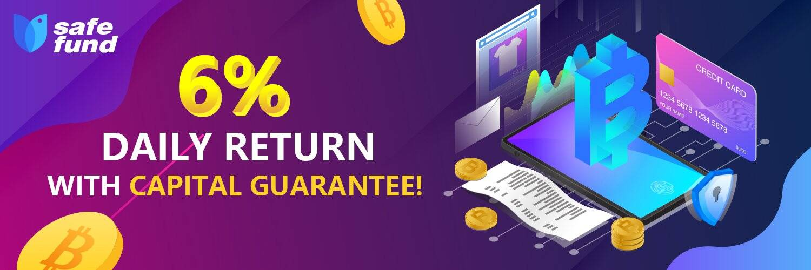

# SafeFund

想要在保证资本的同时获得被动收入吗？ 试试SafeFund，区块链上的第一个保本基金！

安全基金（SAFE）是收集和使用 各国和其他捐助者自愿捐款的 机制，以负责任、一致、透明、高效和及时的方式支持国际民航组织的安全方案。

SAFE 的目的是通过解决缺乏财政手段的国家的严重安全缺陷，以及通过向国际民航组织提供所需的管理储备， 以便立即有效地解决紧急安全问题和对不可预见事件的反应。

