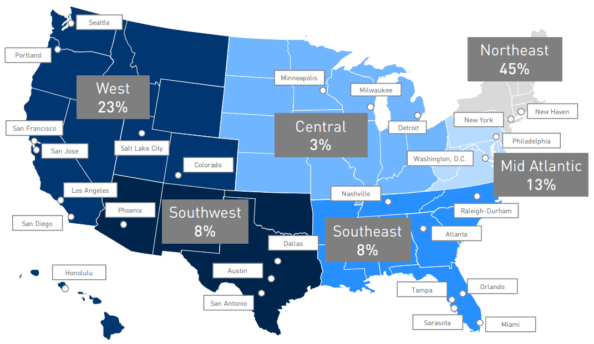

# SafeHodL

购买不收取任何费用，因此有 1% 的滑点

24 小时内卖出：32% 销毁（24% 返还流动资金池，8% 重新分配给持有人） * 72 小时内出售：28% 销毁（21% 返还流动资金池，7% 重新分配给持有人）* 卖出 120 小时内：24% 销毁（18% 返还流动资金池，6% 重新分配给持有人）* 168 小时内出售：20% 销毁（15% 返还流动资金池，5% 重新分配给持有人）* 标准销毁： 16% 销毁（12% 回到流动性池，4% 重新分配给持有人） * * 每个钱包的最大金额 3,000,000,000 * 最大交易 1,000,000,000

