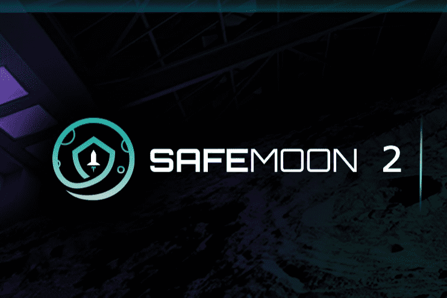

# SAFEMOON 2

SafeMoon 2 协议是一个社区驱动、公平推出的 DeFi 代币。 在每笔交易中都会出现三个简单的功能：反射、LP 获取和销毁。

以人为本的技术和创新业务，为更美好的明天扩展区块链技术。SafeMoon 与其屡获殊荣的社区（SafeMoon Army）紧密相连，并受其推动，正在不断创新。构建区块链、商业、元界和 NFT 产品，从加密技术中获得新的价值，并将其应用到越来越好的用途中。

据 SafeMoon 网站介绍，SafeMoon 是一种去中心化金融(DeFi) 代币，在每笔交易中都有四个功能：反射、LP 收购、代币销毁和增长基金。

SafeMoon 现在正在处理其使命的第二部分——扩展和引导其技术以推动新的创新，以及将这些创新推广到世界各地的风险慈善模式。

使用 SafeMoon 协议，代币持有者将根据他们拥有的代币数量获得更多的 SAFEMOON。SafeMoon 协议将由于其烧币策略而随着时间的推移而获得价值，使其成为一种通货紧缩的数字货币。

SafeMooon 协议将在已经发布的去中心化交易所和移动应用程序的基础上扩展至包括中心化交易所和 NFT 市场。由于 SafeMoon 协议越来越受欢迎，他们制定了雄心勃勃的路线图，他们希望在2022 年底之前发布几款产品。

