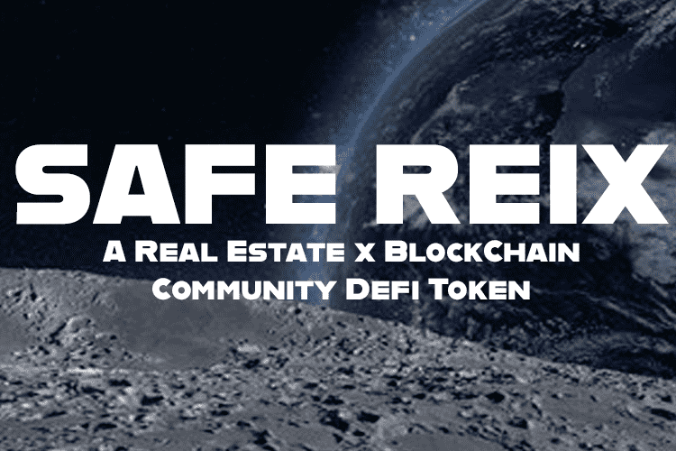

# SafeREIX

SafeREIX
SafeREIX 协议是一个社区驱动、公平推出的 DeFi 代币。
SAFEREIX 代表安全房地产信息交换。 一个社区驱动的 DeFi 代币，其使命是学习、分享、发展和支持房地产和区块链技术。
我们与社区的主要目标是为我们的持有者提供工具、软件和信息。 这对我们来说是一个长期的项目。 我们的目标是可持续发展并永远持续改善我们的社区。 这个社区旨在超越任何人，我们是房地产和区块链的成员，我们相信这些永远不会消失。 我们在这里留下来。 欢迎！
每笔交易需缴纳 10% 的税，具体如下：
4% 反射    4% AutoLP    2% 营销和开发

