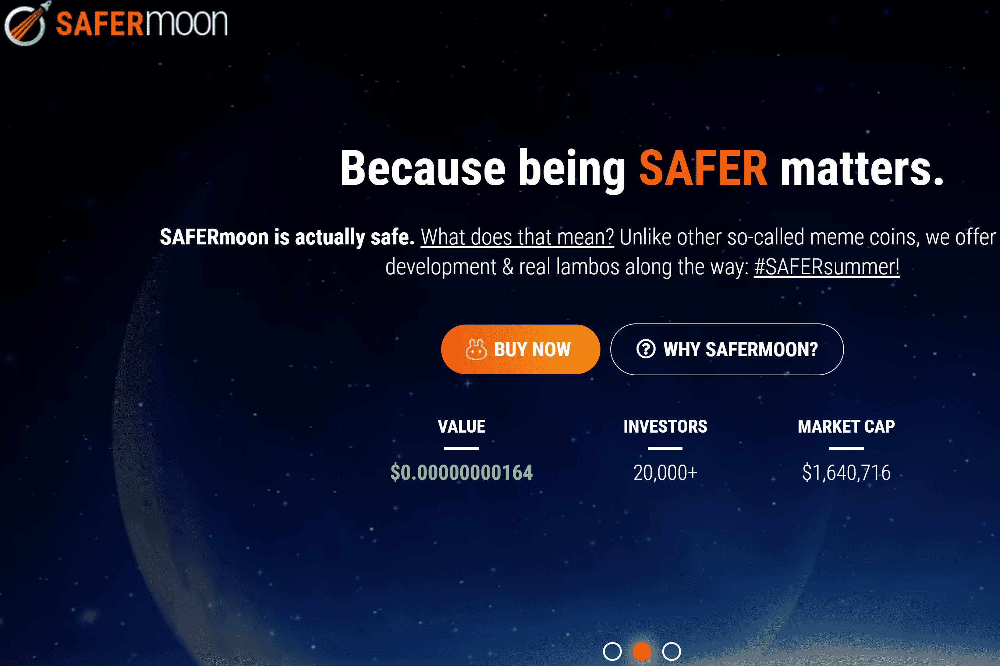

# Safermoon

SAFERMOON 是一种经过审计、审查和信任的 RFI 静态奖励代币，让持有的投资者受益。 10% 的交易费用为代币持有者提供了奖励和流动性，从而提高了 SAFERMOON 的价格下限。 与典型的单产农业奖励相比，SAFERMOON 的静态奖励取决于交易量。 这减少了交易硬币的早期采用者的抛售压力。 为什么？ 因为作为持有者，每次其他投资者出售 SAFERMOON 时，您都会获得奖励。
已经审核了！

轻松奖励
5% 的交易费按比例重新分配给所有 SAFERmoon 投资者。 拿着你的代币，看着你的钱包余额稳步攀升。
比赛
我们希望通过将 SAFERmoon 代币赠送给幸运的获奖者，在 Telegram 上的 SAFERmoon 社区中保持乐趣。

