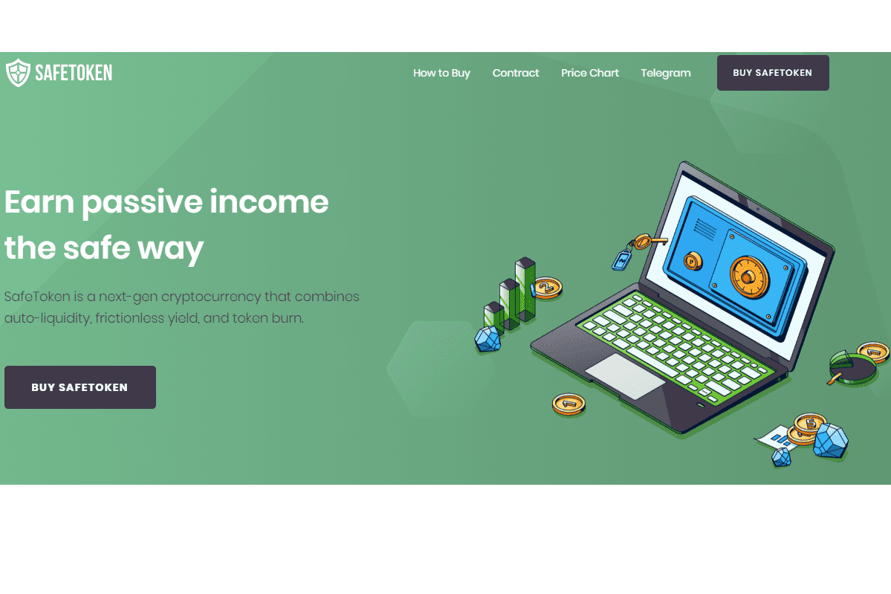

# SafeToken

什么是安全令牌？

  1. 自动流动性：每笔交易（买入或卖出）的 5% 将被添加到流动性池中并锁定。 这会随着时间的推移创造一个不断上涨的价格底线（降低“价格影响”）和更好的长期安全性。

  2. 无摩擦收益/农场：每笔交易的 5% 作为奖励分配给持有者。 这意味着您甚至不必移动肌肉 - 您只需赚取更多代币。

  3.安全和安保：在我们的第一周内，我们已经与顶级审计师 WAR ON RUGS 和 Rug Detectives 完成了 2 次成功的审计。

