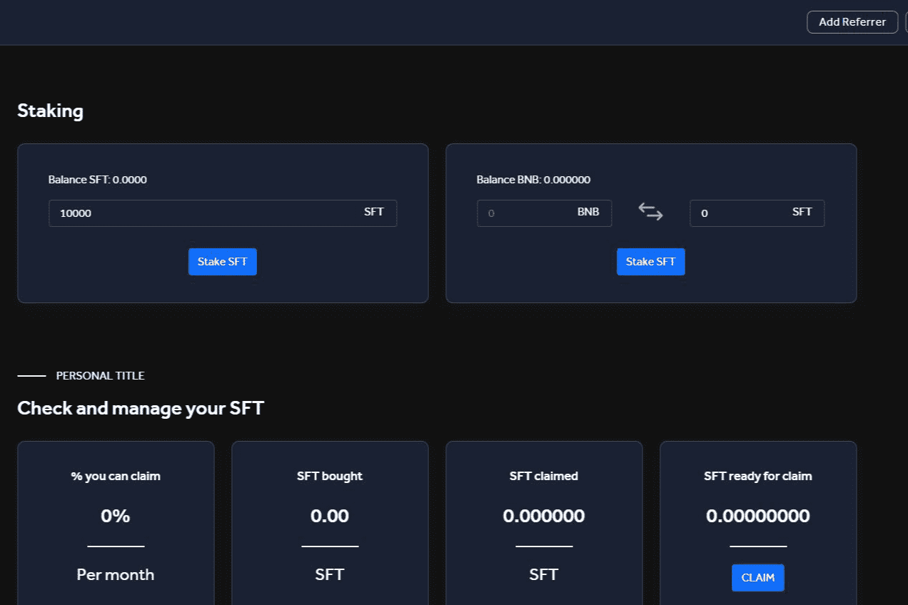

# Safety

安全来自一个在加密行业拥有多年经验的团队，并开发了一个在 Coinmarketcap 上排名第一的中心化交易所。但是，随着 DeFi 极强的流量和尚未开发的潜力，我们决定朝着多网络去中心化的方向研究和开发一个全新的生态系统。在很多区块链网络被认可并被广泛使用的今天，找到一个能够保证稳定性和可扩展性的网络是一个两难的选择。通过社区经验的调查和评估，Safety 决定选择币安智能链来构建生态系统，其重点是将整个 Dapp 部署在币安投资的 Safepal 数字货币包平台上。 Safepal是一个允许区块链多网络操作的电子钱包平台，这也是安全的优势和开发团队的长期定位。安全性的诞生是为了解决当前市场参与交易的障碍，通过在不同区块链之间轻松流通账本资产，有望在这个十亿美元的市场上为协议开辟新的方向

