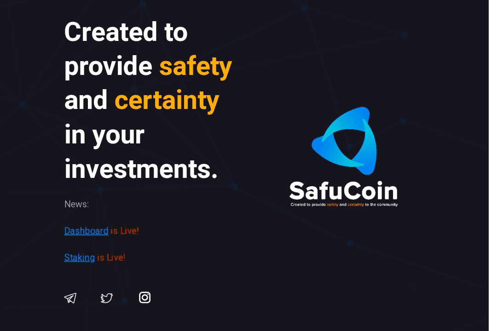

# SAFUCOIN

在 SAFU，我们有一个简单而明确的使命：确保您的资金是 SAFU。 SAFU 开发了第 2 层 KYC 验证服务 SAFUCheck，为在币安智能链内运营的企业提供身份验证，以确保投资者安全。 SAFU 通过我们的第 2 层 KYC 系统超过了金融机构的监管 KYC 标准。 KYC 代表了解您的客户。 KYC 标准旨在保护金融机构和投资者免受欺诈、腐败、洗钱和恐怖主义融资。 行业标准KYC验证包括三个部分； 身份证、人脸、证件验证。 不幸的是，随着技术的进步，阻碍这一过程的方法也在进步。 这在加密货币领域中表现得最为明显。 我们是来改变这一点的。

