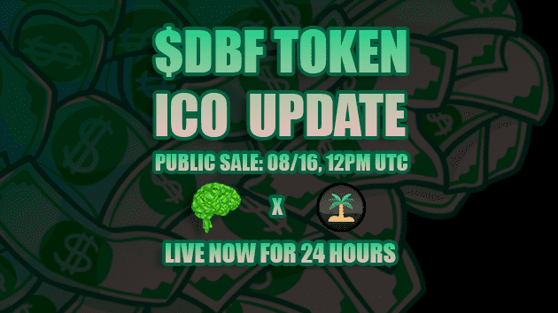

# Sahara DAO

Sahara DAO 是一种合成协议，旨在为 Cronos 网络提供新的创新合成市场。该协议的目标是为最受欢迎的 Cronos 代币以及尚未在链上交易的资产提供和维护合成市场。
Sahara DAO 引入了部分抵押设计，其中协议的合成器由基础资产和 Sahara 的原生代币支持。
Sahara DAO 是一种合成协议，旨在为 Cronos 网络提供新的创新合成市场。该协议的目标是为最受欢迎的 Cronos 代币以及尚未在链上交易的资产提供和维护合成市场。
Sahara DAO 引入了部分抵押设计，其中协议的合成器由基础资产和 Sahara 的原生代币支持。
专为 MMF 代币粉丝打造：Sahara DAO
借助 Sahara DAO，我们通过采用部分抵押设计引入了去中心化解决方案，其中合成代币部分由 MMF 和 MUSD 代币支持，部分由我们的原生代币支持。

