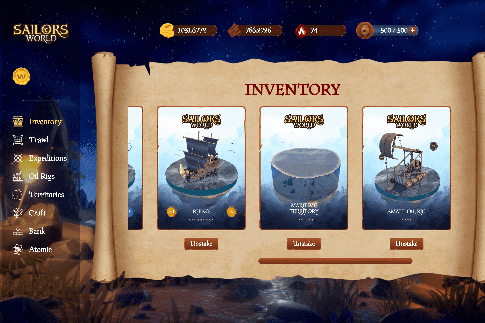

# Sailors World

Sailors World 是一款基于 NFT 的探险游戏，具有动态经济模型。 玩家可以建造船只，开采资源，探索海洋。
建立自己的水手世界舰队，挖掘资源，参加远征和战斗！

Sailors World 是 WAX 区块链上的一款探索性 NFT 游戏，具有建造船只、航行以发现发现、寻宝和战斗海盗的能力。

水手世界的浩瀚宇宙由被三大洋的海水冲刷的许多大陆和群岛组成。由于有大量未开发的海域和航线，水手们有机会进行不止一次激动人心的冒险。他们在途中遇到了既隐于世间的古人珍宝，又渴望轻松捕食的海盗。所有玩家都从港口城市托尔图加开始，他们的目标是探索周边地区并收集必要的资源，向岛屿和大陆派遣认真的探险队。

到达最近的群岛只能在他们自己的船上进行。在被一只看不见的手慷慨地散布在水面上的岛屿上，有需要他人帮助并慷慨奖励新来的水手的当地人。

过了一会儿，这整个美丽的海洋世界将最终形成，并向所有来者敞开大门。

