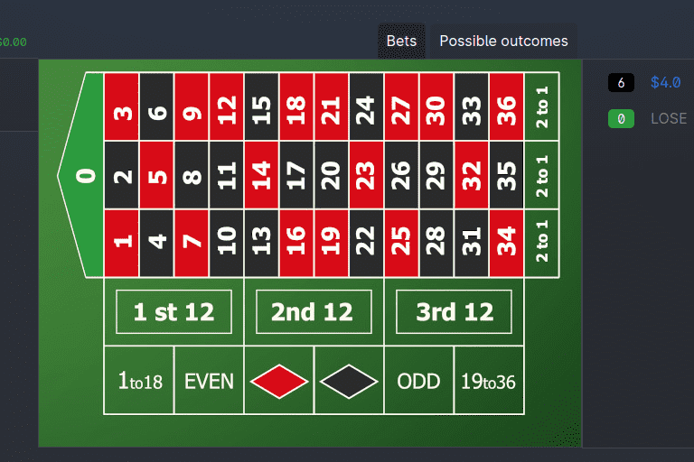

# Sakura Casino

SakuraCasino 是一个基于 Polygon 网络的去中心化在线赌场。 赌场由部署在 Polygon 主网上的轮盘合约和与该合约交互的 UI 组成。
SakuraCasino 使用 Chainlink VRF，这是 Chainlink 的预言机网络为智能合约提供的可验证随机函数。 这是第一个具有真正随机数生成功能的可证明公平的加密轮盘赌。
轮盘赌之所以部署在 Polygon 网络中，是因为它的运营费用低。 下注成本不到一美分，您就可以使用 DAI 稳定币。
轮盘赌收益的汇集和赚取利息对所有人开放。
轮盘合约部署在区块链中。 它不能被修改或篡改。 任何拥有 Polygon 钱包和 DAI 代币的人都可以通过简单地与合约交互来下注或提供流动性。

