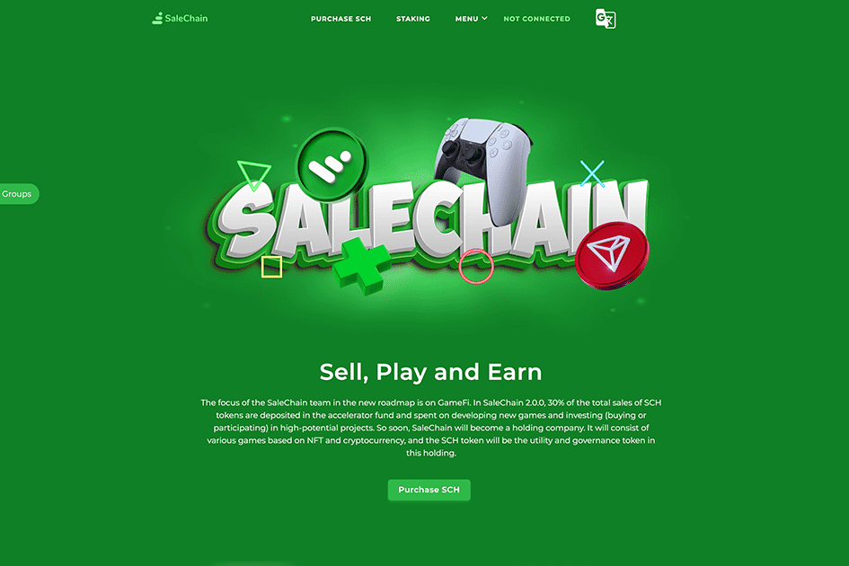

# SaleChain

SaleChain 团队在新路线图中的重点是 GameFi。 在 SaleChain 2.0.0 中，SCH 代币总销售额的 30% 存入加速器基金，用于开发新游戏和投资（购买或参与）高潜力项目。 很快，SaleChain 将成为一家控股公司。 它将由基于 NFT 和加密货币的各种游戏组成，SCH 代币将是该持有的实用程序和治理代币。

SaleChain 是一个基于 Tron 区块链网络销售区块链产品的国际零售商链。 人们通过在这个去中心化的应用程序（DAPP）中形成他们的销售网络，在没有任何第三方参与的情况下参与所有产品的销售。 您只需购买至少 50 个 SCH (SaleChain Token) 代币即可进入该项目的销售链，您将永远获得出售该项目任何产品的利润。

