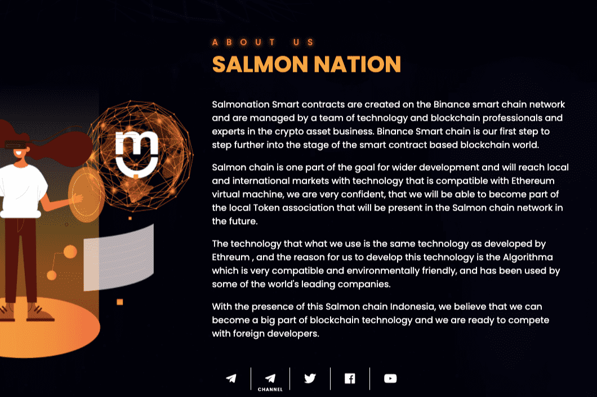

# Salmonation

Salmonation 智能合约是在币安智能链网络上创建的，由技术和区块链专业人士以及加密资产业务专家组成的团队管理。币安智能链是我们进一步迈入基于智能合约的区块链世界阶段的第一步。 Salmon 链是更广泛发展目标的一部分，它将以与以太坊虚拟机兼容的技术进入本地和国际市场，我们非常有信心，我们将能够成为将出席的本地 Token 协会的一部分在未来的 Salmon 链网络中。我们使用的技术与 Ethreum 开发的技术相同，我们开发这项技术的原因是算法非常兼容和环保，并已被一些世界领先的公司使用。随着 Salmonchain 在印度尼西亚的出现，我们相信我们可以成为区块链技术的重要组成部分，我们已准备好在全球竞争。主题是，我们是印度尼西亚第一个 defi 区块链，正如您从其他国家了解印度尼西亚投资市场国家一样。来自鲑鱼社区，我们希望我们的社会，使用区块链来吸引更多的投资者到我们的国家，并且可以使用我们的区块链通过加密创造轻松的投资。对于工业部门、旅游部门、房地产部门、艺术部门等，我们的成就构建结构 DeFi 区块链也得到了几位公众人物的赞赏。现在，我们也教育，开发工程师，建立一个符合sertification标准的项目。为子孙后代。

