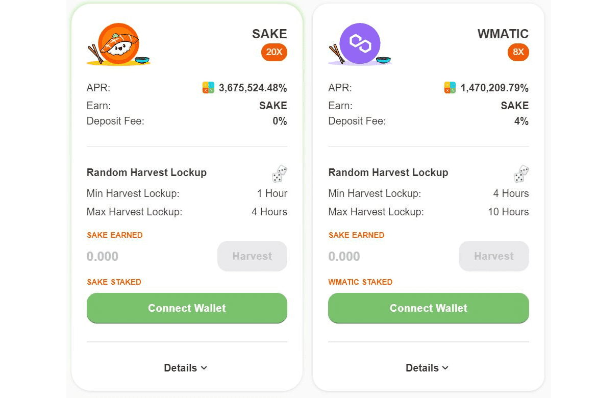

# SalmonDefi

介绍
SalmonDefi 刚刚登陆 BSC AVAX MATIC FTM KCC 网络。
SalmonDefi 由一支敬业的专业团队（1 名领导者 + 3 名开发人员 + 2 名支持人员）构建。我们将致力于生态系统的成长和成功。
特征
SalmonDefi 将提供这些服务
Yield Farm：通过质押流动性池代币赚取 SAKE 代币
自动燃烧将在每笔交易（发送、交换、耕种等）中燃烧。
自动流动性 通过合约自动流动性池。将添加自动流动性
Harvest Random 基本上，每次您在我们的农场上种植任何代币时，您都会获得介于 Min 和 Max 之间的随机锁定时间
推荐 - 每次您的推荐收集他们的 SAKE 时，奖励将自动发送。
Anti Whale - 保护鲸鱼投资者倾销价格体系
Delegate Faming：收益农场的创新将有助于增加代币价值。更多细节可以在代表农场部分找到。
自动清酒：自动复合您的清酒质押，如此惊人的功能。
矿池：当您在矿池中质押代币时，这些奖励将被出售并交换为您存入的代币，然后再添加回您的头寸。这使您可以通过不断复利来赚取被动收入。我们的金库不仅支持代币，还支持 LP 代币。

