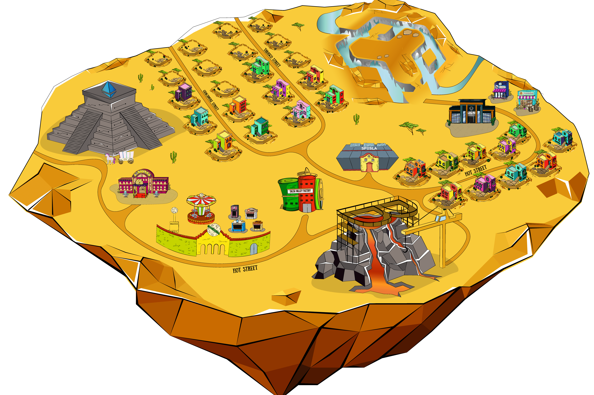

# Salsa Valley Game

这款 NFT 游戏将模拟加密市场参与者的行为，用于教育和娱乐目的。它还将为真实区块链项目的创建者、用户、投资者和玩家之间提供一种新的互动方式和虚拟场所。
Salsa Valley Game - 是基于动画系列“Salsa Valley Stories”（关于加密世界的有趣 meme 卡通）的 NFT 和加密 Mooniverse。
1. 在用户拥有的虚拟加密世界中创建、探索和交易。
萨尔萨谷是墨西哥的一个山谷，但在一个平行的宇宙中，虚拟的加密货币 Mooniverse。这是一款在线 NFT 游戏，但侧重于加密爱好者之间的社会和经济互动。
用户可以交流、参加有关区块链技术的讲座、公开表示他们自己的区块链项目、探索加密世界、在其中创建新对象，并为他们的游戏行为赚取 Salsa 代币。
2. 测试你的想象力极限
使用简单的 Builder 工具创建场景、艺术品、挑战等，然后参加活动赢取奖品。对于更有经验的创作者，SVG 提供了让世界充满社交游戏和应用程序的工具。
3. 数字资产的虚拟目的地
在 Salsa Valley Marketplace 购买和出售 Estates、Avatar 可穿戴设备和名称：储存由 Binance Smart Chain 支持的最好的数字商品和用具。
游戏的开发处于技术场景阶段。
我们已经拥有基于我们的卡通系列铸造的第一部分 NFT 角色、物品和庄园，并放置在三个 TOP NFT 市场，这也是我们的官方合作伙伴：Treasureland、JGN 和 Babylons。
获得乐趣并成为胡椒！
4. 
