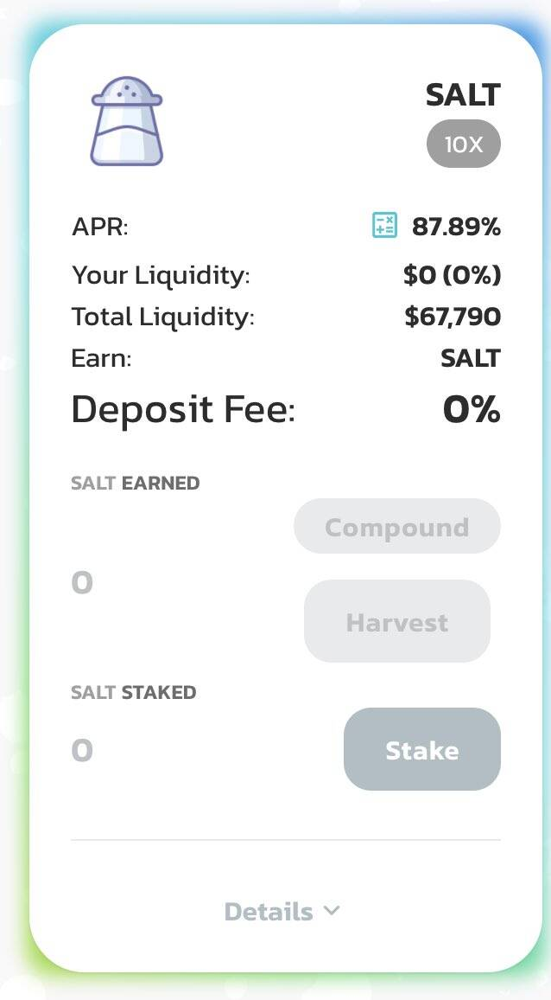

# SaltSwap

SaltSwap - 巨大的 APY

SaltSwap 池允许您通过将代币添加到流动性池或“LP”来提供流动性。
当您将代币添加到流动性池 (LP) 时，您将收到 FLIP 代币（流动性提供者代币的 SaltSwap 版本）。
例如，如果您将 $SALT 和 $BNB 存入流动资金池，您将收到 SALT-BNB FLIP 代币。
您收到的 FLIP 代币数量代表您的端口

这对流动性提供者来说并不全是坏事，因为您还将获得交易费用形式的奖励。每当有人交易 SaltSwap 时，交易者支付 0.2% 的费用，其中 0.17% 被添加到他们交易的掉期对的流动性池中。

例如：

有 10 个 FLIP 代币代表 10 个 SALT 和 10 个 BNB 代币。

1 FLIP 代币 = 1 SALT + 1 BNB

有人用 10 个 SALT 换取 10 个 BNB。

其他人用 10 BNB 换取 10 SALT。

SALT/BNB 流动性池现在有 10.017 SALT 和 10.017 BNB。

每个 FLIP 代币现在价值 1.00017 SALT + 1.00017 BNB。

