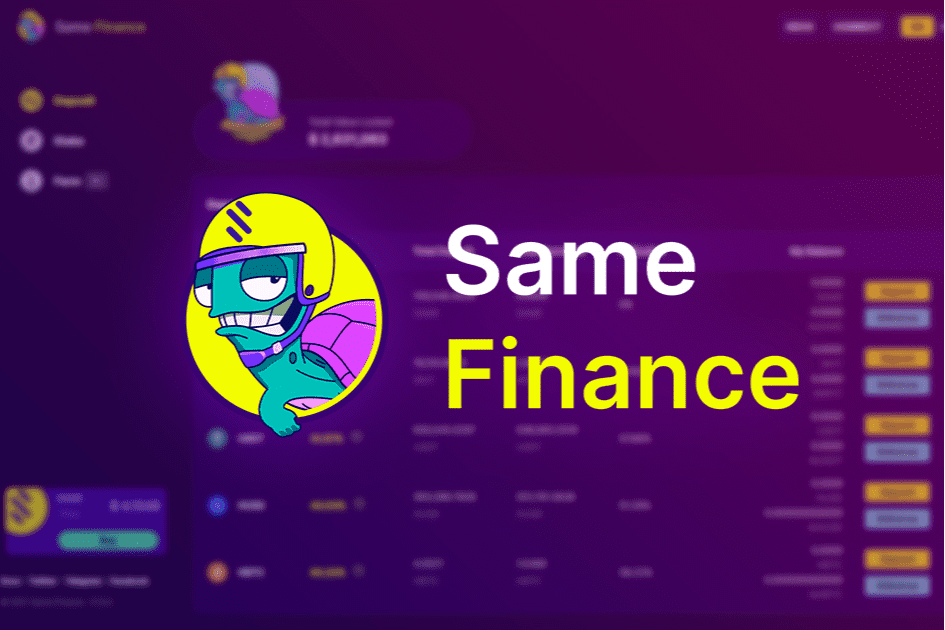

# Same Finance

Same Finance 是一种杠杆收益农业协议，专注于稳定币收益农业以获得更稳定的收益。 SameFinance 的简单存款和直观的用户体验还旨在让收益农业更容易获得。 SameFinance 提供高达 11 倍的流动性资金，让矿工获得超额挖矿利润。
Same Finance 通过一系列复杂的合约机制巧妙地链接借贷双方，不断提高 DeFi 市场的整体资金利用率。在带来更高回报率的同时，也最大限度地保障了用户资金的安全。
多链 - SameFinance 在 HECO 区块链上可用，稍后在 2021 年第四季度至 2022 年第一季度在 BSC、POLYGON 和 HSC 上发布。
存款 - 将代币存入存款池并在您的代币被其他用户借入时赚取利息。使用新的稳定币存款池以低风险赚取收益。
质押 - 质押您的有息代币并赚取相同的代币，最大化您的回报！
农场 - 借代币开立杠杆收益农业头寸，为您赚取相同的代币，头寸更大，风险更高

