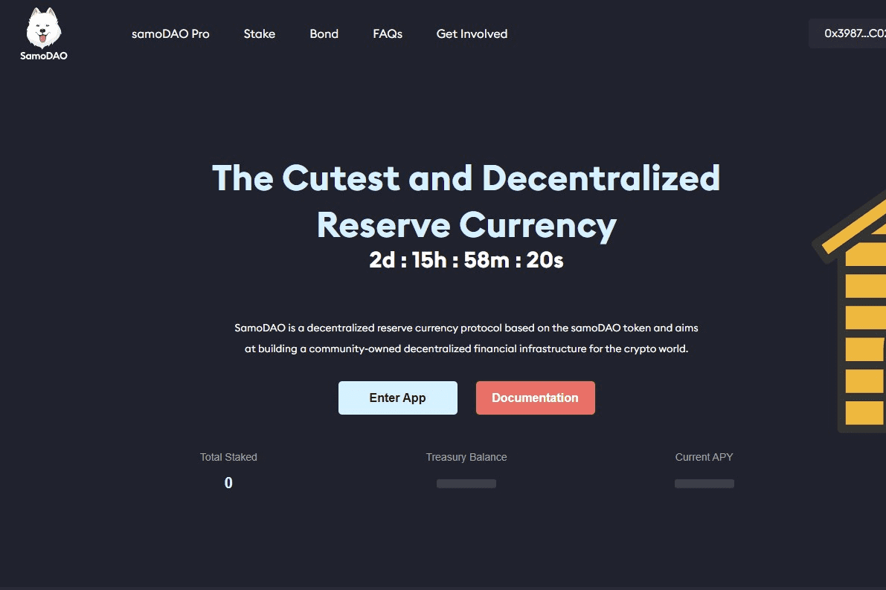

# SamoDAO

什么是萨摩道？
SamoDAO 是币安智能链上的去中心化储备货币平台。与与美元价值挂钩的 DAI 或 USDC 不同，SamoDAO 的储备金由 SamoDAO 财政部持有。
SamoDAO 是 DeFizer.io 生态系统的一部分。
SamoDAO 是一种自由浮动货币，由我们的稳定币 BUSD 的国库供应支持。 samoDAO 代币不能由协议以外的任何人铸造或烧毁。该协议仅在响应价格时这样做。每个 samoDAO 代币至少有 1 个 BUSD 支持。如果 samoDAO 代币的交易价格低于 1 BUSD，协议会回购并销毁 samoDAO 代币，将价格推回至 1 BUSD。协议对 samoDAO 代币的潜在交易价格没有上限。
samoDAO 代币由 BUSD 支持，而不是与其挂钩。这使得 samoDAO 代币能够实现稳定的浮动价值，同时永远不会低于其支持资产的价值。代币价格设计为等于（1 BUSD + 溢价），“溢价”反映市场价值。
samoDAO 代币还通过债券扩大其国库。债券通过协议出售不同资产，作为回报，买方以显着折扣价收到 samoDAO 代币。这增加了资金，使我们能够为我们的用户创造令人难以置信的收益。

