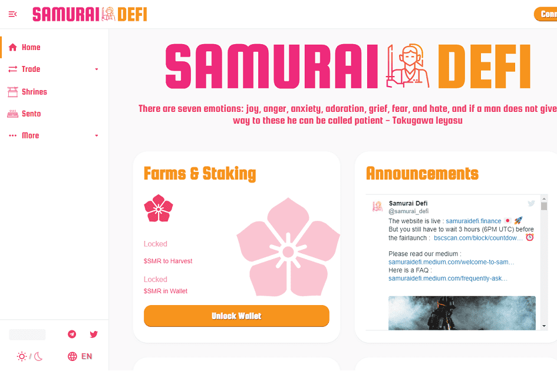

# Samurai DeFi

Samurai DeFi 是 BSC 上一个非常创新的项目（不要错过我们的功能！）
🗻 安全：
✅ 时间锁定（6 小时）
✅ 移除迁移代码
🗻 特点：
⚠️自动刻录⚠️
所有交易的 2% 将被自动销毁，以减少 $SMR 的总供应量。
所有存款费用的 75% 将分配给回购 $SMR（每 200 万 TVL 进行一次回购）。
⚠️减半（自动减排）⚠️
每 9600 个区块（大约 8 小时），我们将自动将 $SMR 的排放率降低 5%（直到我们达到每个区块 0.2 $SMR）。
作为早期采用者的奖励，在第一个小时内，每个区块的所有奖励都会有一个乘数的奖励（每个区块将铸造 2 美元 SMR）。 第一个小时后，每块 1 美元 SMR，然后每 9600 个块减半（自动减排）。
🗻 代币经济学：
代币：$SMR
初始供应：2000
初始价格：0.50 美元

