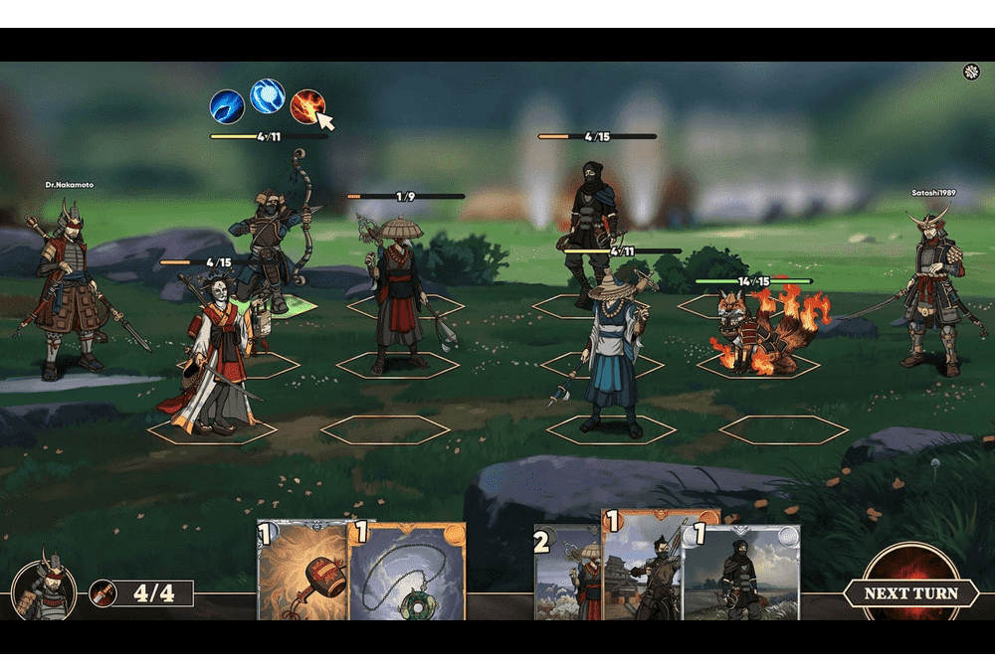

# Samurai Legends

Samurai Legends 是一个以封建日本为背景的大战略角色扮演虚拟世界。
在单一的大型多人游戏世界中，玩家进行 PvP 战斗、构建、制定战略并参与政治，以进一步提升他们在游戏世界中的地位和影响力。借助 DeFi 协议和区块链技术，最终玩家将控制构成游戏世界的社会、经济、政治和军事效用。
土地和单位 NFT
• 永久拥有和可玩的游戏资产 • 土地产生资源以创建或铸造新的游戏资产，例如物品或单位 • 单位组成战队漫游并与 PvP 和 PvE 战斗，赚取 $KOKU • 土地和高级单位可以出租给学者赏金，赚取被动收入
武士传奇的愿景
一开始，玩家将填充一个游戏世界。土地和角色可以被拥有和使用，以利用世界提供的各种机会。这种体验类似于典型的 MMORPG，包括探索、任务、角色发展、战斗和部落，但可以获得真正的货币价值，去中心化提供了超越典型游戏的非脚本机会。
通过基于 DAO 的氏族和政治实体选举，建立了一个角色扮演的虚拟世界，玩家可以在其中决定结果。

