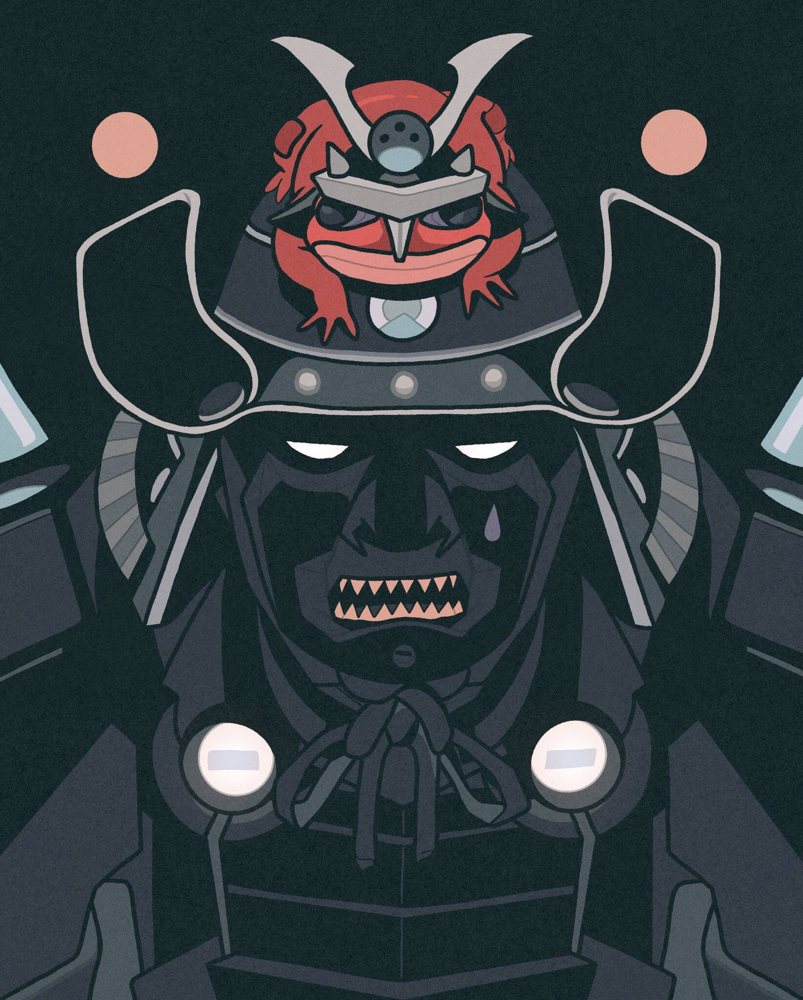

# SAMURAI

武士是一个基于中国著名小说《三国志》故事的基于OEC的链上RTC+TCG游戏生态系统

关于SAMURAISTEAM
SAMURAISTEAM由不同类型的游戏组成。一个英雄可以在整个武士游戏中使用。力量、物品、分数可以在所有游戏中使用。

玩家提高技能和增加力量以获得奖励，也鼓励创作者在工作室创造物品、坐骑和武器来帮助其他人玩 DAO 决定游戏开发、国库和收入管理。

核心元素，NFT资产，横跨samurai steam全游戏。
创建或购买不同的武器和装备来提升英雄的技能并赢得战斗。
创建坐骑和守卫一起战斗以保护英雄。
提高所有游戏的关卡、技能和战斗以获得分数。
消耗紫水晶等物品，提升英雄品质和等级。
支付门票，购买物品，费用和税收升级英雄。

SAMURAISTEAM 由实用程序（SGP）和治理（SAMU）令牌的双重令牌模型运行。它们将用于交易，在所有游戏中进行交换。

