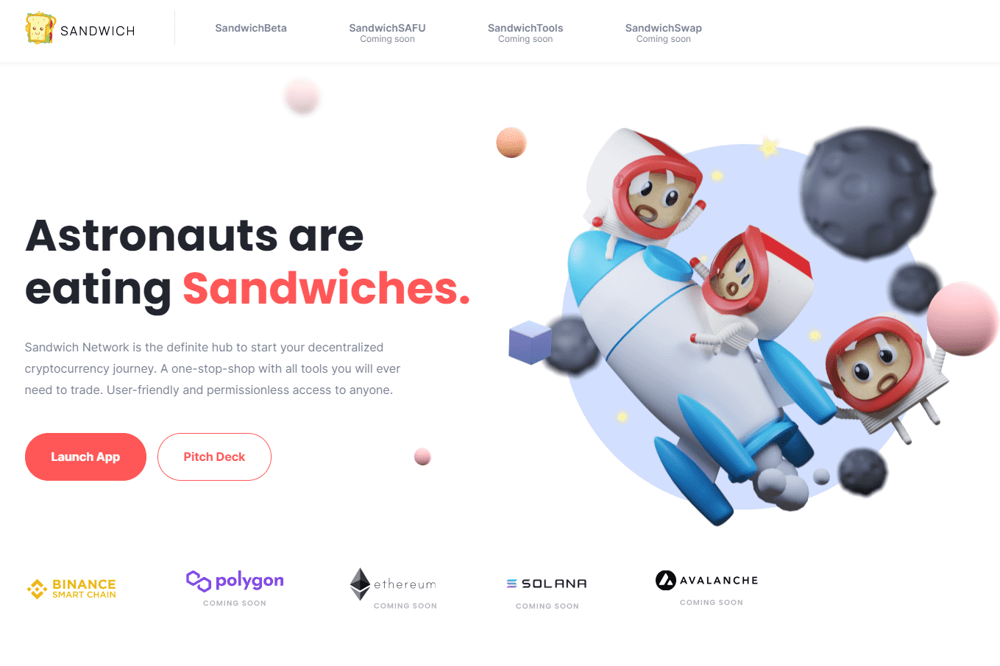

# Sandwich Network

Sandwich Network 是启动加密货币项目的明确枢纽。 对任何人都友好且无需许可的访问。 Sandwich 是真正去中心化和非托管的，因此任何与 Web3 钱包连接的用户都可以铸造、启动、锁定和使用所有未来的 Dapp。
问题
目前，投资、启动和跟踪加密货币项目的市场高度分散。 对于所有事情，您都需要不同的工具，这可能会令人沮丧，但也可能导致错误，例如丢失资金或跟踪投资和持股。
解决方案
分散市场的问题可以通过为投资者或项目所有者提供所需的一切提供中心枢纽来解决。 这正是我们对 Sandwich Network 所做的事情。 为任何人提供交易和跟踪 DeFi 代币所需的所有工具的一站式商店。 

