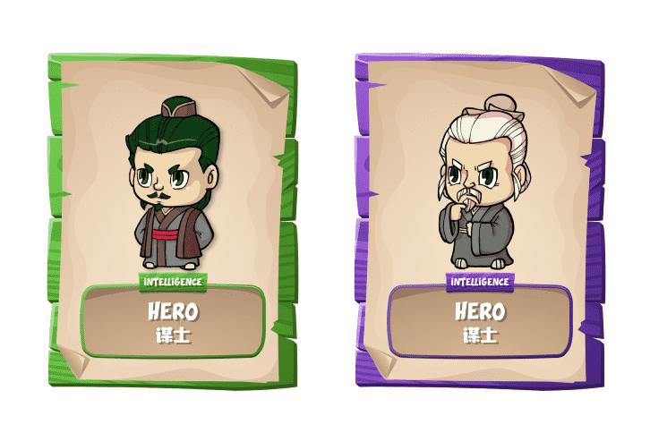

# Sanguo Z World

Sanguo Z World 是一款 WAX 区块链游戏，玩家可以在其中赚取 YUAN 代币和 NFT。 在战斗中，玩家通过获得足够的声望来升级，解锁并探索三国Z世界的新功能。
游戏有3个代币，分别是YUAN、TROOP和WEAPON。 这3个代币中，YUAN是可提现的，在Alcor交易所交易，TROOP & WEAPON是游戏内代币，不可提现。
YUAN Token 参与战斗获得YUAN，战斗胜负决定玩家获得多少YUAN。
玩家等级决定每日奖励，等级越高，冷却时间越短，奖励越高。
TROOP Token Player 可以使用 YUAN 或 Farmers World 的 FWF 租用 TROOP
玩家可以使用 FWF 治愈受伤的 TROOP
在战斗中，玩家可以获得随机数量的部队
Dead TROOP 将退役。 （总供应量减少）
WEAPON Token Player 可以通过 YUAN 或 FWG+FWW 获得 WEAPON
损坏的武器将退役。

