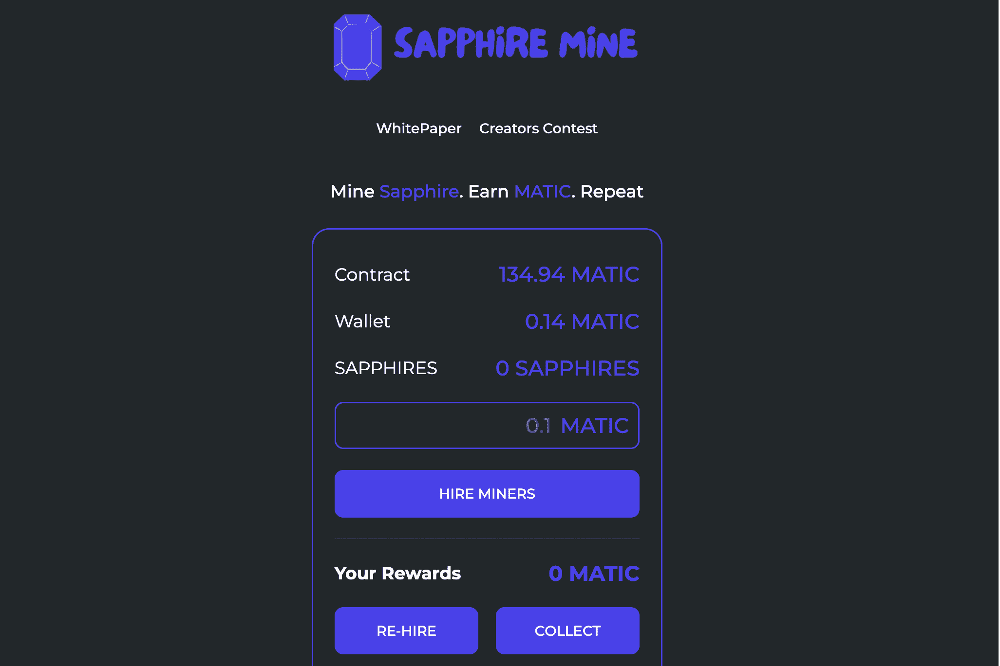

# Sapphire Mine

具有高每日回报和低开发费用的多边形奖励池

什么是蓝宝石矿？
蓝宝石矿是红宝石矿成功后发现的矿。 在这个矿山中，您将获得与在 Ruby 矿山中相同的机会。 这个矿藏有无限量的蓝宝石。 从中分一杯羹，让您的矿工永久开采蓝宝石以赚取利润。

矿业   在您通过 MATIC 成功收购您的矿工后，他们会立即开始工作，每天为您带来高达 8% 的利润。

推荐    邀请您的朋友加入蓝宝石矿，并从他们的投资中获得 12% 的利润。

化合物    每天将您赚取的回报再投资以雇用更多矿工，他们将从矿场为您获取越来越多的蓝宝石，从而成倍增加您的利润。

费用    8% 的蓝宝石投资和销售费用

重新投资奖励时不收取任何费用

