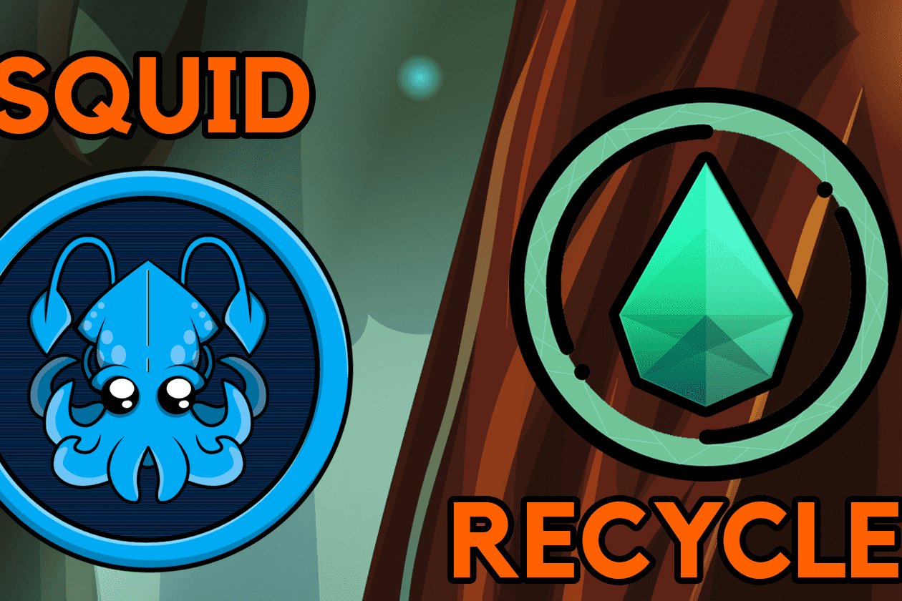

# Sapphire Recycle

Sapphire DeFi，Fantom Network 上全新的多链 DeFi Yield Farming，帮助投资者保护他们的资金，因为我们提供透明的环境，让用户可以无忧使用我们的服务，并有助于通过 Staking 带来稳定的被动收入！ 以 0 美元的存款费质押并赚取原生代币！ 我们的主要目标是在 Fantom 网络上提供安全的 DeFi 收益农业！

就像之前的层一样，原生代币接近达到其最大供应量。请注意，达到此最大值后，未决奖励将继续累积，但无法获得任何奖励。用户将能够正常提取存款，但没有待处理的奖励。

最大供应量为 10,000 代币的鹅叉

Sapphire Defi的第 3 层。合约类似于它们的前一层。
⚠️ Masterchef 目前没有时间锁定
✅ 最高 4% 的存款费用
✅ 支持所有转让税代币
✅ 代币所有权已被放弃
Masterchef 仍然使用区块号作为奖励计算的手段。
10% 的排放量发送到开发地址
提供给 WFTM-RECYCLE LP 的 7.5 个 RECYCLE 代币（164.16 个 WFTM-RECYCLE LP 代币已被烧毁，在审查时约为 94%）
3.3 提供给 USDC-RECYCLE LP 的 RECYCLE 代币（0.00012 USDC-RECYCLE LP 代币已被烧毁，在审核时约为 100%）

