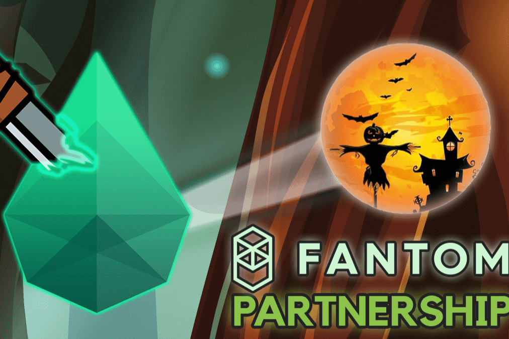

# Sapphire War

Sapphire War DeFi，Fantom Network 上全新的多链 DeFi Yield Farming，我们提供透明的环境，帮助投资者保护他们的资金，让用户可以无忧使用我们的服务，并有助于通过 Staking 带来稳定的被动收入！ 以 0 美元的存款费质押并赚取原生代币！ 我们的主要目标是在 Fantom 网络上提供安全的 DeFi 收益农业！

最后报告的WAR价格为0.022984 美元。蓝宝石战争的最后一个市值是未知的。24 小时WAR容量未知。它的市值排名未知。蓝宝石战争在交易所交易。蓝宝石战争在10 个月前创下 3,426 美元的历史新高。过去一天，Sapphire War的透明交易量为0% ，并在3 个活跃市场上交易量最高的交易对 0 是 .

