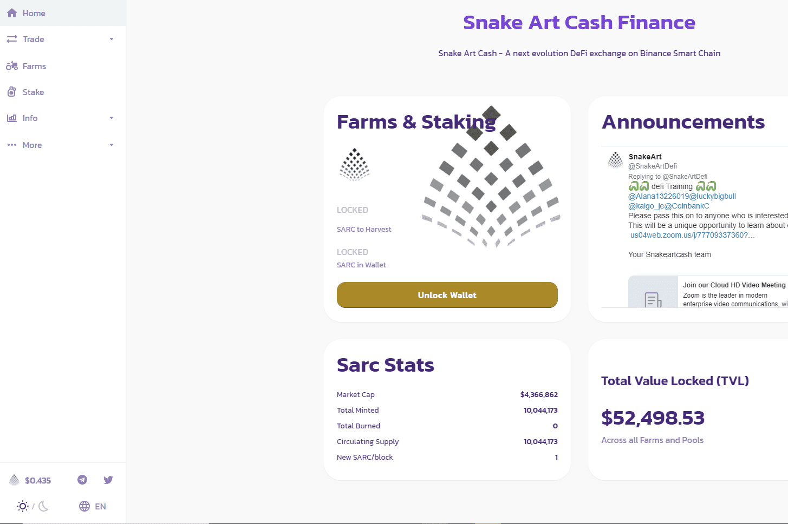

# SARCSWAP

什么是 SARCSWAP ？

SARCSWAP / SnakeArt Cash

SnakeArt Cash 是 SnakeArt 生态系统的货币。

SnakeArt Cash 是一个完全由社区驱动的 DeFi 代币，为您持有的加密资产提供可观的利息。 使用 SnakeArt Cash，您可以通过在单产农业和质押中提供流动性来利用被动收入。 此外，由于作为 AMM（自动做市商）的去中心化性质，SnakeArt Cash 执行您的加密货币交易的障碍更少。 这些费用用于通过执行回购来稳定项目。

