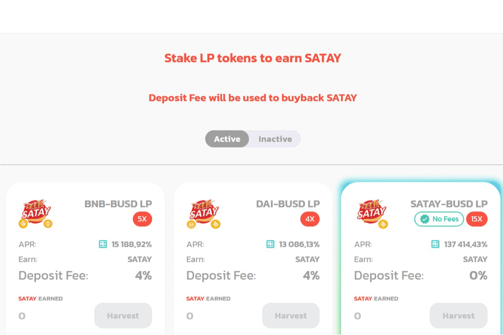

# Satay Swap Finance

🍢 Satay Swap Finance - Binance Smart Chain （BSC）上的下一次进化 DeFi 交换
通过收益耕作赚取 SATAY 或在彩票中赢取它，然后将其投入池中以赚取更多代币！ 在您可以信任的平台上提供初始农场产品（由 Satay Swap Finance 开创的新代币发布模型）、NFT 等

Satay Swap Finance dApp 是基于币安智能链协议构建的DeFi类别的加密资产。现在，根据用户数量，它在一般 dApp 排名中排名第 6814位，在DeFi类别中排名第 1139位，这让您可以很好地了解Satay Swap Finance dApp 在其竞争对手中的表现。

通过分析最近 30 天窗口的 Satay Swap Finance dApp 数据，很明显 dApp 的Balance为$ 0.00，Volume稳定在$0.00。Satay Swap Finance在 30 天内产生了0 笔交易，变化为 0% 。显然，与之前的 7 天相比，成交量稳定了0% 。最近 7 天的数据显示，Satay Swap Finance 的用户基数为0，并且稳定了0%。

我们还建议查看Satay Swap Finance Activity Overview & Balance of Smart Contracts 图表，了解这些重要指标如何随时间波动和变化。

