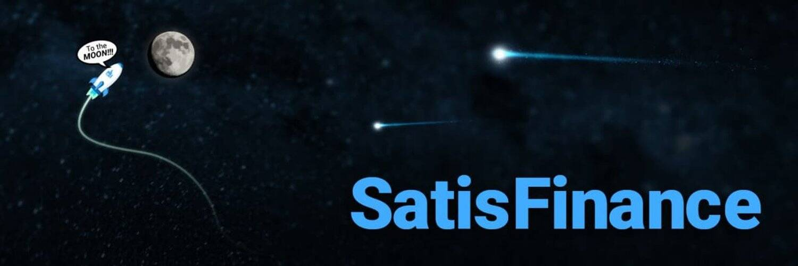

# SatisFinance

SatisFinance 是 GooseDefi 和 Fullsail Finance 的分叉项目，凭借其独特的回购和 Hybird 销毁机制，使其成为 BSC 上的第 4 代通缩收益农业项目。

欢迎来到 SatisFinance——币安智能链上的第四代通缩收益农场

SatisFinance 是一个全新的 DeFi 项目，由经验丰富的开发团队设计，具有独特的 Satisfi 回购协议。

除了 Goose Finance 引入的回购销毁机制和 Fullsail Finance 引入的自动减排和 2% 转让税外，我们还实施了一项更独特的通货紧缩功能，以应对大多数 3 代以下单产农场面临的通货膨胀问题。

突出显示的功能：
·自动减排
·混合燃烧机制
——回购&LP燃烧
——转让税燃烧（每笔交易将直接燃烧2%的转让税）
——满足回购协议
·移除迁移者代码
·发布时添加时间锁

