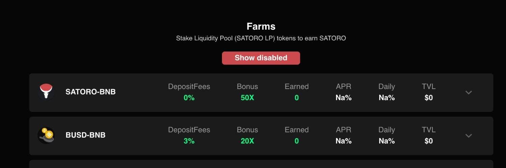

# SatoroSwap

什么是 SatoroSwap ？

SatoroSwap 是在币安智能链 (BSC) 上运行的去中心化交易所和收益农业
我们是一个社区运行的项目，将由社区投票管理协议的所有重大更改。（投票将很快部署。）
所有合约都将被时间锁定，延迟 6 小时，当农场开始让社区审查所有更改时。
业务战略和整体发展最终由 Satoro 团队决定。

我们下一步该怎么做？ 彩票、博彩？
我们还在寻找合作伙伴，将 NFT 引入平台，这样我们就可以在农场进行推广。

