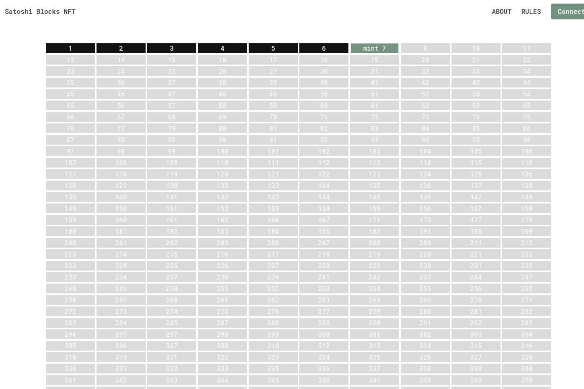

# Satoshi Blocks NFT

每个“Satoshi Block”都是一个独特的数字艺术，灵感来自于中本聪早期采矿产生的丢失比特币的故事。
中本聪是比特币创造者使用的化名。 许多消息来源发现，他在比特币的前两年（2009-2010）开采了至少 21479 个区块，每个区块有 50 个未使用的 BTC 奖励。
比特币协议使用“merkle root”来验证区块，并且一个唯一的“merkle root”与这些区块中的每一个与 Satoshi Nakamoto 开采的丢失比特币相关联。
每个 Satoshi Block NFT 都是使用 merkle root long 数字生成的独特数字艺术的数字签名，以向永远丢失和未使用的比特币的相应区块编号（或高度）致敬。
Satoshi Blocks NFT 符号是“HFB”，以纪念中本聪真实身份。

