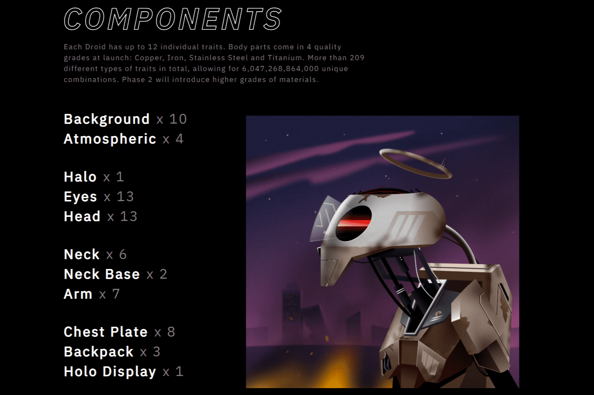

# Savage Droids SD888

机器人战争已经持续多年。 一方面，Theos。 一家科技公司凭借其突破性的人工智能迅速崛起，现在控制着地球上最有价值的资源。 在另一边，社区，一个破烂的反叛组织决心打倒 Theos。 Savage Droids Lore

在善恶的世界里，你站在哪一边？ （我们不会透露）要铸造 8,888 个机器人。 4,444 个社区机器人。 4,444 个 Theos 机器人。
公开发售：太平洋时间 2021 年 9 月 8 日晚上 8 点。 这将是一个延迟披露。 跳入 Discord 以获取最新信息，包括。 预售详情。
预售期间的 1 次铸币交易。 1个派系。 在预售期间，您不能多次或与多个派系一起铸造。

