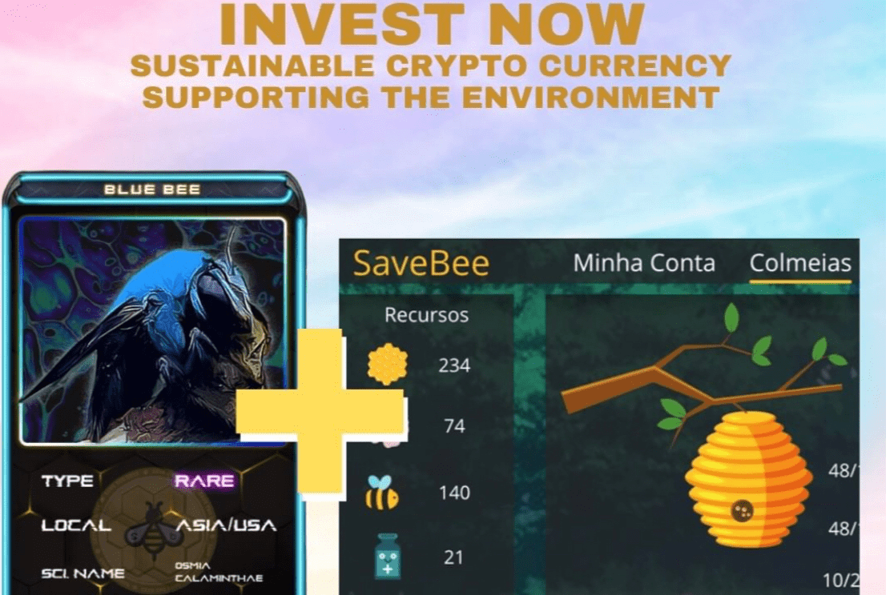

# SAVEBEE

SAVEBEE 它是为帮助拯救地球而生成的代币，蜜蜂是主要的授粉媒介。

保存蜜蜂农场

SAVEBEE Farm 是一款专注于区块链和蜜蜂保护的在线游戏。游戏的目标是建立一个蜜蜂农场，玩家将能够随着时间的推移获得惊人的收益。

关于游戏
最初，玩家投资 HONEYCOMB 代币进行游戏，通过这笔投资，玩家将获得一个蜂箱用于他的农场，并能够在游戏中获得更多资源。

从那里，玩家可以开始照顾他的蜂巢农场，增加其产量，然后将收入转换为 SAVEBEE。你玩的越多，你赚的越多。

SAVEBEE 团队已经在进行许多新功能的更新，例如培育具有特殊增益的 NFT 蜜蜂和保卫蜂巢的战斗。

NFT
在游戏的第二阶段（beta2）中，SAVEBEE FARM 将使用 NFTS，这将使您的收入增加高达 1000%。

现在可以通过 SAVEBEE 商店购买 NFT。SAVEBEE 很快就会有一个 NFT 市场来交易它们，这将被用来为游戏增加更多的能量。

