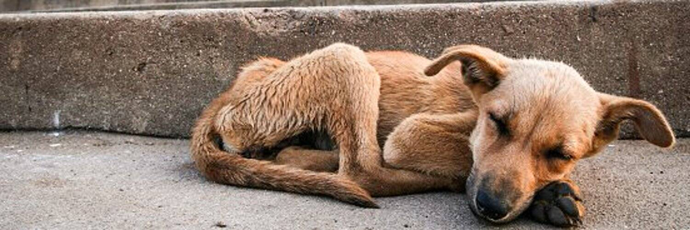

# SaveDogeToken

这个项目是 Bacely 的慈善计划，旨在拯救地球上的狗狗 .. 希望人们喜欢与我们合作

SaveDogeToken 是一个 DeFi 平台。他们的主要目标之一是支持动物福利。换言之，SaveDogeToken 是一种慈善代币。SDT 是为该项目提供动力的官方代币。SaveDogeToken 在 BSC 上运行

SaveDogeToken dApp 是一种基于币安智能链协议的高风险类别的加密资产。现在，根据用户数量，它在一般 dApp 排名中排名第 4305位，在高风险类别中排名第 2005位，这让您可以很好地了解SaveDogeToken dApp 在其竞争对手中的表现。

通过分析最近 30 天窗口中的 SaveDogeToken dApp 数据，很明显 dApp 的Balance为$ 0.00，Volume稳定在$0.00。SaveDogeToken在 30 天内生成了0 笔交易，变化率为 0%。显然，与之前的 7 天相比，成交量稳定了0% 。最近 7 天的数据显示，SaveDogeToken用户基数为0，并稳定了0%。

