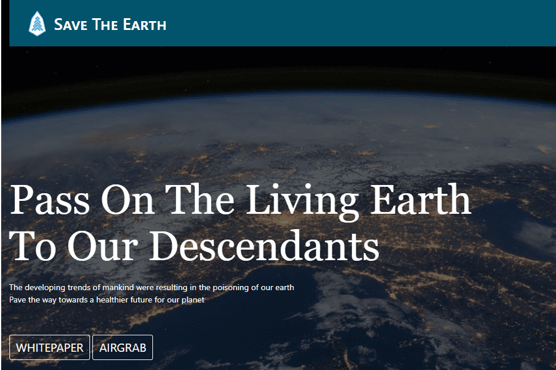

# savetheearth

STE的使命是追踪地球空气的变化
通过在 EOS 上记录地球的空气污染
区块链，并确保地球有干净的空气。

超过 80% 的自然破坏——灭绝和气候变化——来自法律活动。需要您的声音来解决这种环境破坏的根本原因，并帮助将我们的社会转变为一个和谐共存并尊重荒野和环境的社会。

帮助世界各地的草根活动家将自然重新引入最需要自然的地方

恢复我们已经失去的 30% 的自然有助于扭转气候变化并避免其最严重的影响。

现在，您可以帮助我们的星球稳定气候变化、阻止大规模灭绝并降低新流行病的可能性。您可以保护重要的荒地，保卫濒危和受威胁物种的家园，并使人们能够过上美好的生活，并与自然世界相处得更好。

